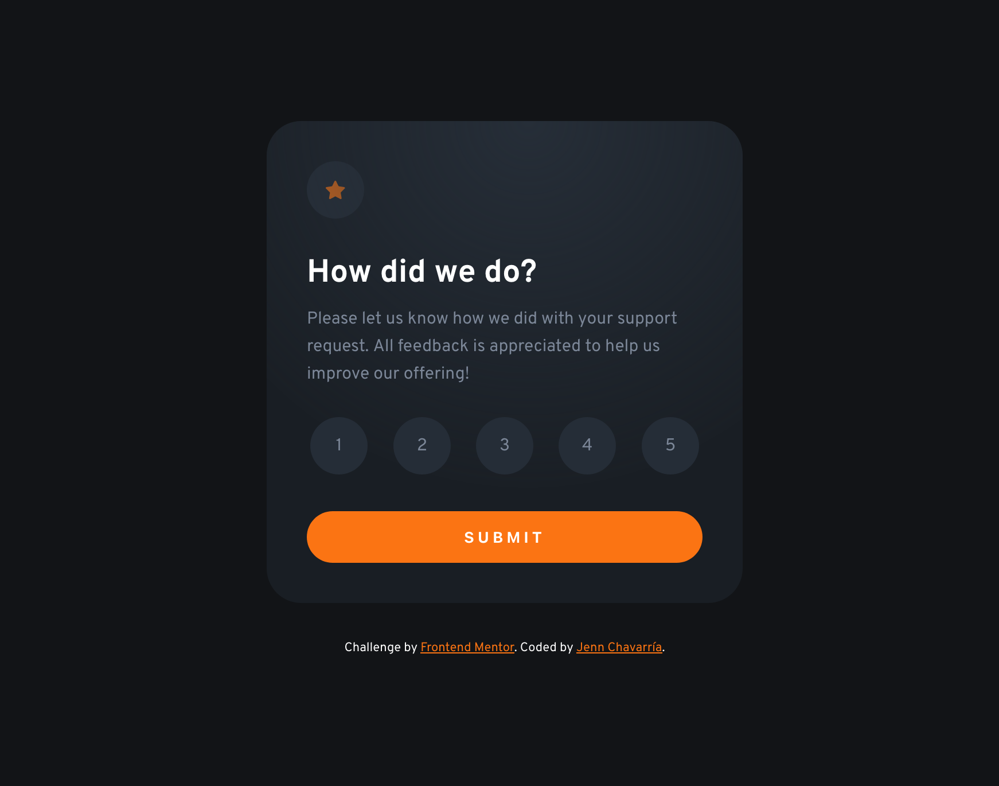

# Frontend Mentor - Interactive rating component solution

This is a solution to the [Interactive rating component challenge on Frontend Mentor](https://www.frontendmentor.io/challenges/interactive-rating-component-koxpeBUmI). Frontend Mentor challenges help you improve your coding skills by building realistic projects. 

## Table of contents

- [Overview](#overview)
  - [The challenge](#the-challenge)
  - [Screenshot](#screenshot)
  - [Links](#links)
- [My process](#my-process)
  - [Built with](#built-with)
  - [What I learned](#what-i-learned)
  - [Continued development](#continued-development)
  - [Useful resources](#useful-resources)
- [Author](#author)
- [Acknowledgments](#acknowledgments)

**Note: Delete this note and update the table of contents based on what sections you keep.**

## Overview

### The challenge

Users should be able to:

- View the optimal layout for the app depending on their device's screen size
- See hover states for all interactive elements on the page
- Select and submit a number rating
- See the "Thank you" card state after submitting a rating

### Screenshot



### Links

- Solution URL: [Github Repo](https://github.com/jenn-chav13/interactive-rating-component)
- Live Site URL: [Github Pages](https://jenn-chav13.github.io/interactive-rating-component/)

## My process

### Built with

- Semantic HTML5 markup
- Flexbox
- Mobile-first workflow
- [React](https://reactjs.org/) - JS library

### What I learned

I decided to try my hand at React. I tried to keep the code as clean and readable as posible.
Doing that, I learned how to pass a component into another. 
Also, I learned how to deploy a React app using Github Pages. It was difficult and it didn't work at first, but it worked out in the end. I think turning the property `private` property to `false` in the `package.json` helped when deploying the code using Github Pages.

<br>

### Some code I am proud of


```jsx
<React.StrictMode>
    <RatingComponent title="How did we do?" description="
      Please let us know how we did with your support request. All feedback is appreciated 
      to help us improve our offering!" ratingOptions={[1, 2, 3, 4, 5 ]}/>
    <AttributionComponent author="Jenn Chavarría" profileLink="https://github.com/jenn-chav13"/> 
  </React.StrictMode>
```

## Author

- Frontend Mentor - [@jenn-chav13](https://www.frontendmentor.io/profile/jenn-chav13)
